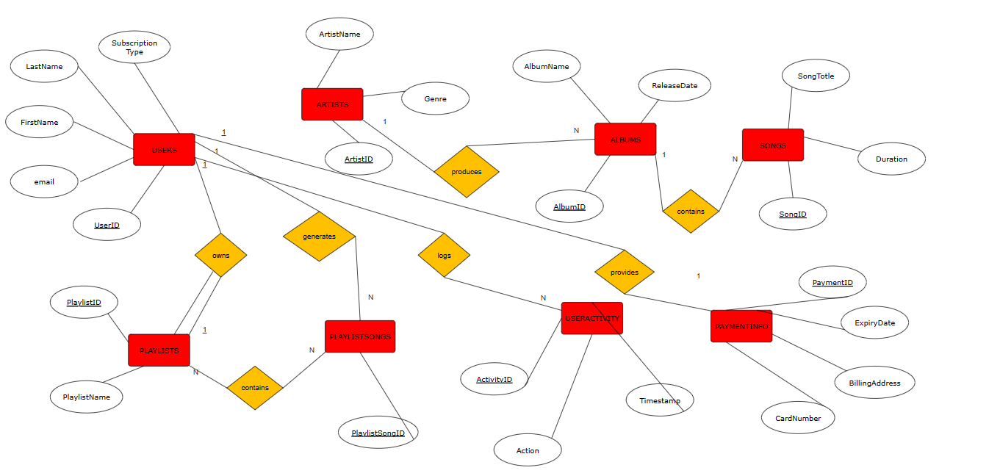
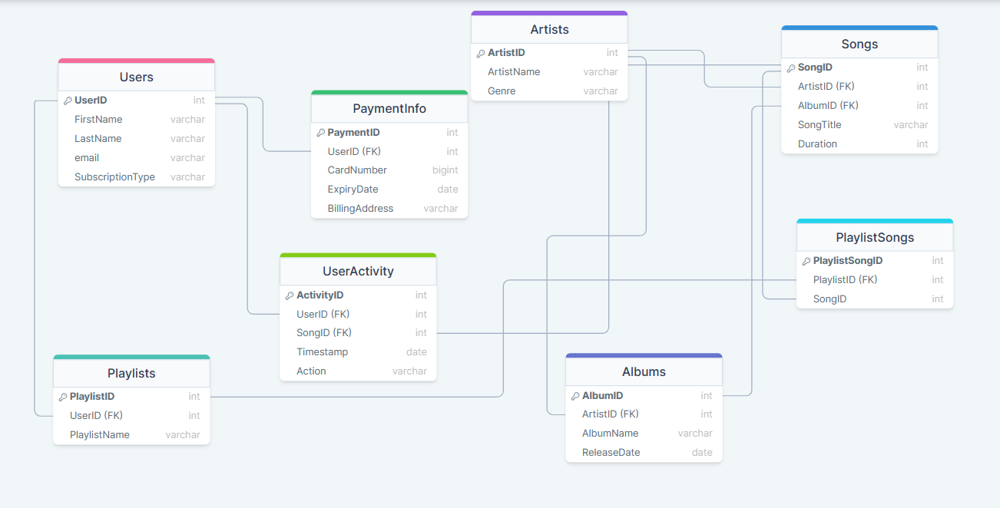

# Hackhoven's Music Database System

## Overview
This repository contains the Music Database System, a simple music database designed as a final project for a Database Management Systems (DBMS) course. The system features SQL scripts for setting up and managing a music streaming service's database, including schema creation, data insertion, and sample queries for common operations.

## Repository Contents
- **ERD.png** - Entity Relationship Diagram showing the database schema and relationships.
- **Relational.png** - Diagram illustrating the relational model of the database.
- **drawSQL-mysql-export.sql** - MySQL export file with the database schema. This file was generated using drawSQL.
- **music.sql** - SQL script for creating database tables and inserting initial data.
- **queries.sql** - A collection of SQL queries demonstrating basic operations like data insertion, update, retrieval, and deletion within the database.

## Diagrams

### Entity Relationship Diagram (ERD)


### Relational Model Diagram


## Getting Started

### Prerequisites
To run the SQL scripts contained in this repository, you will need:
- MySQL Server (You can download it from [MySQL official website](https://www.mysql.com/))

### Setting up the Database
Follow these steps to set up your database:

1. **Create the Database**
   - Launch MySQL command line client or MySQL Workbench.
   - `source music-database-system\book.sql`

2. **Import Database Schema**
   - Import `drawSQL-mysql-export.sql` to your MySQL Server. This sets up the database schema.
     ```bash
     mysql -u yourUsername -p MusicStreamingService < path_to/drawSQL-mysql-export.sql
     ```
   - Replace `yourUsername` with your actual MySQL username, and `path_to` with the actual path to the file.

3. **Populate Database**
   - Run `music.sql` to create the necessary tables and populate them with initial data:
     ```bash
     mysql -u yourUsername -p MusicStreamingService < path_to/music.sql
     ```

4. **Run Sample Queries**
   - Execute the queries in `queries.sql` to see how data can be manipulated and retrieved:
     ```bash
     mysql -u yourUsername -p MusicStreamingService < path_to/queries.sql
     ```

## Usage
Utilize this database to understand how a basic music streaming service could manage its data using MySQL. It's ideal for educational purposes, such as learning SQL and database management concepts.

## Contributions
Feel free to fork this project and adapt it to your needs. Contributions, suggestions, and improvements are welcome.
